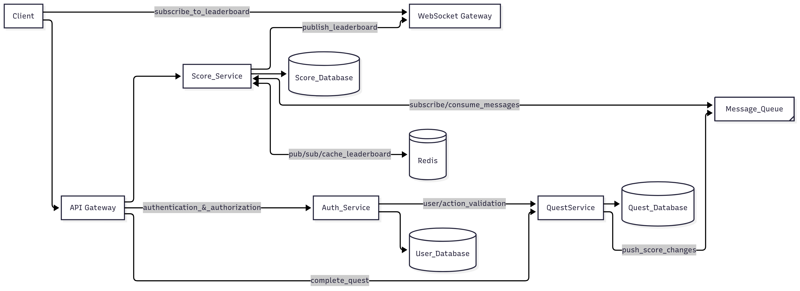

# Live Scoreboard API Service Specification

| Date       | Changelog | Updated By |
| ---------- | --------- | ---------- |
| 2025-07-23 | Initial   | Phat Mai   |

---

### Context:

- Given that a client wants to build a web application allowing users to log in and complete predefined quests to earn scores. At the end of each season, the top 10 users on the scoreboard will receive tangible rewards as part of the client's business model.

### Goals:

- Provide secure endpoints/api for the web app to show top 10 user's highest score, which support live updates.
- Validate and process score increments securely to ensure data integrity, avoiding/preventing unauthorized score manipulation.
- Support high concurrency with low latency and scalable infrastructure.

## Architecture Overview

## Component Details

| Component                      | Description                                                                                                                                          | High-Load Strategies                                                                                                                                                |
| ------------------------------ | ---------------------------------------------------------------------------------------------------------------------------------------------------- | ------------------------------------------------------------------------------------------------------------------------------------------------------------------- |
| API Services                   | Stateless REST + WebSocket endpoints for score updates & leaderboard broadcast                                                                       | Horizontally scalable behind load balancer, autoscaling                                                                                                             |
| Redis                          | Use Redis to hold leaderboard sorted sets & pub/sub for broadcasting updates                                                                         | Redis Cluster to horizontally shard data & pub/sub                                                                                                                  |
| Authentication & Authorization | JWT validation service or middleware ensures authorized requests only                                                                                | Separate auth microservice, caching JWT public keys                                                                                                                 |
| Score Validation               | Business logic to validate score increments, rate limiting, anomaly detection                                                                        | Distributed in API servers with cache synchronization                                                                                                               |
| WebSocket Gateway              | Handles large-scale connection management, keeps persistent WS connections                                                                           | Use dedicated WS gateway (e.g., NGINX,...) with sticky sessions                                                                                                     |
| Messaging Queue                | This is a critical middleware component responsible for asynchronous, reliable, and decoupled communication between Quest Service and Score Service. | Continuously monitor queue depth, processing lag, and broker health, choose the right tools for each case(Kafka, RabbitMQ, Redis Streams) base on applcation scale. |

---

## Flow of Execution

## Improvements for High Load

- **API Servers**
  - Stateless + horizontally scalable, behind load balancer (e.g. NGINX)
  - Implement local caching & JWT key distribution updates asynchronously
- **Message Queue**
  - Use Kafka/Redis Streams for pub/sub guarantees and buffering bursts
- **WebSocket Scaling**
  - Dedicated WebSocket cluster (sticky session) or use WebSocket proxy/load balancer
- **Security**
  - Enforce per-user and per-IP rate limits (API Gateway + service)
  - Behavioral anomaly detection through analytics pipeline
  - Keep audit logs for suspicious actions

## Monitoring & Metrics

| Metric                  | Description                                   |
| ----------------------- | --------------------------------------------- |
| WebSocket Connections   | Number of active WS connections               |
| API Request Rate        | Incoming score update requests / sec          |
| Redis Latency           | Avg execution time for sorted set ops         |
| JWT Validation Failures | Number of unauthorized attempts               |
| Rate Limit Hits         | Count of rejected requests due to rate limits |
| Score Update Anomalies  | Number of suspicious score increments         |
